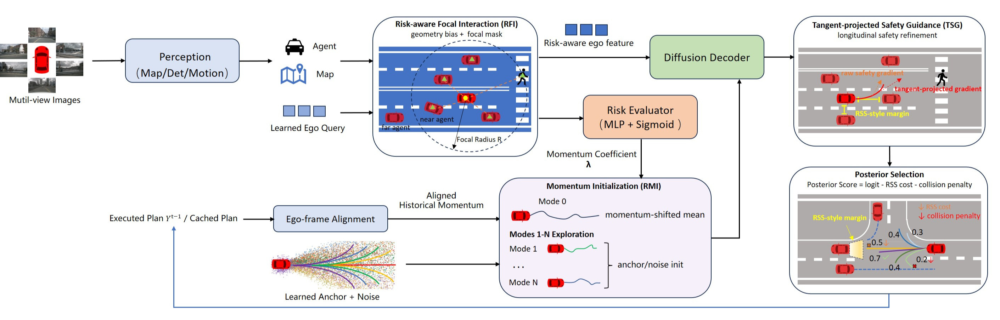
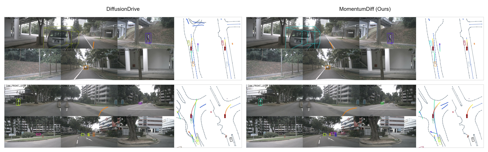
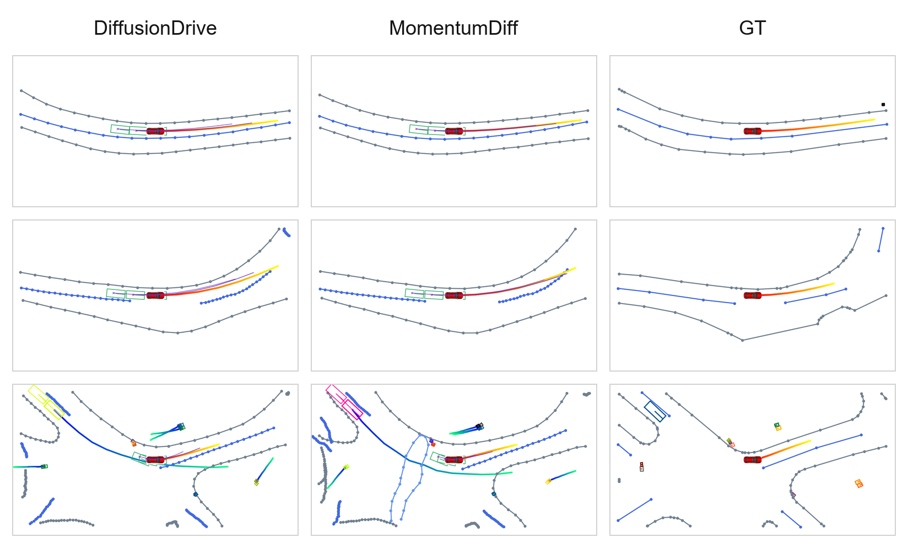

# MomentumDiff

Research code for **MomentumDiff: Risk-Adaptive Momentum and Tangent-Projected Safety Priors for End-to-End Diffusion Planning**. This implementation builds on DiffusionDrive and SparseDrive and includes nuScenes planning evaluation, Turning-nuScenes evaluation, temporal planning consistency (TPC), and visualization utilities.

Due to limited preparation time, this repository provides a DiffusionDrive-based rapid reproduction version. The source code is here, and pretrained checkpoints are linked below. It is not the complete implementation described in the paper. The full implementation is coming soon.

For this private preview, the weights are hosted in an existing private GitHub Release. Access to that repository is required to download them. nuScenes data and generated metadata must be prepared separately. The included experiment config and planning anchors cover the 3s setting; the reported 6s results require a separate 12-step config, metadata and anchors.

## Highlights

- End-to-end camera-based planning on nuScenes.
- Diffusion planning head: `projects/mmdet3d_plugin/models/motion/motion_planning_head_v13.py`.
- Planning metrics with L2, collision rate, and TPC: `projects/mmdet3d_plugin/datasets/evaluation/planning/planning_eval.py`.
- Turning-nuScenes subset generation: `tools/create_turning_subset.py`.
- Visualization with frame-range control and optional video skipping.

## Overview

<p align="center">
  
</p>

The method treats few-step diffusion planning as constrained prior injection: risk-adaptive momentum is injected at initialization to stabilize the main-intention mode, while tangent-projected RSS-style safety guidance is applied at the final denoising stage to reduce unsafe candidates without rewriting the generated path topology.

## Key Results

The table below keeps only the most diagnostic metrics from the paper rather than duplicating every experiment table.

| Setting | Method | L2 (m, lower) | Col. Rate (%, lower) | TPC (m, lower) |
| --- | --- | ---: | ---: | ---: |
| nuScenes 3s Avg. | DiffusionDrive | 0.57 | 0.08 | 0.49 |
| nuScenes 3s Avg. | **MomentumDiff** | **0.55** | **0.04** | **0.45** |
| Turning-nuScenes 3s | DiffusionDrive | 1.06 | 0.17 | 0.97 |
| Turning-nuScenes 3s | **MomentumDiff** | **0.97** | **0.06** | **0.83** |
| Turning-nuScenes 6s | DiffusionDrive | 3.13 | 1.77 | 2.03 |
| Turning-nuScenes 6s | **MomentumDiff** | **2.91** | **1.34** | **1.97** |

## Qualitative Examples

<p align="center">
  
</p>

<p align="center">
  
</p>

## Repository Layout

```text
projects/configs/                 Model and experiment configs
projects/mmdet3d_plugin/           Model, dataset, metric, and CUDA op code
tools/data_converter/              nuScenes info generation
tools/kmeans/                      Anchor generation
tools/visualization/               Qualitative visualization utilities
docs/                              Setup, training, evaluation, and release notes
assets/, resources/                Public figures used by project documentation
```

## Installation

This project follows the MMDetection3D/SparseDrive-style environment. A typical setup is:

```bash
conda create -n momentumdiff python=3.8 -y
conda activate momentumdiff

# Install PyTorch/CUDA versions compatible with your server first.
# Then install OpenMMLab dependencies following your CUDA/PyTorch stack.

# Compile the custom CUDA op.
cd projects/mmdet3d_plugin/ops
python setup.py build_ext --inplace
cd -
```

Use the package versions from the [DiffusionDrive nuScenes setup](https://github.com/hustvl/DiffusionDrive/tree/nusc), or an already working SparseDrive environment with the same CUDA/PyTorch stack.

## Data Preparation

The config reads nuScenes from `data/nuscenes/`. Link your dataset there, then generate infos:

```bash
mkdir -p data
ln -s /data/nuscenes data/nuscenes

PYTHONPATH=. python tools/data_converter/nuscenes_converter.py nuscenes \
    --root-path data/nuscenes \
    --canbus data/nuscenes \
    --out-dir ./data/infos/ \
    --extra-tag nuscenes \
    --version v1.0 \
    --skip-test
```

Generate anchors:

```bash
python tools/kmeans/gen_hierarchical_kmeans.py
python tools/kmeans/kmeans_det.py
python tools/kmeans/kmeans_map.py
python tools/kmeans/kmeans_motion.py
python tools/kmeans/kmeans_plan.py
```

## Checkpoints

Model weights are available from the [existing checkpoint release](https://github.com/momentumdiff/planning-artifact/releases/tag/v0.1-checkpoints). Download them to `ckpts/` locally; they are not committed to the source tree.

| Checkpoint | Download |
| --- | --- |
| 3s planning | [planning_nuscenes_3s_r50.pth](https://github.com/momentumdiff/planning-artifact/releases/download/v0.1-checkpoints/planning_nuscenes_3s_r50.pth) |
| 6s planning | [planning_nuscenes_6s_r50.pth](https://github.com/momentumdiff/planning-artifact/releases/download/v0.1-checkpoints/planning_nuscenes_6s_r50.pth) |

Expected files for 3s reproduction:

```text
ckpts/sparsedrive_nuscenes_stage1_r50.pth
ckpts/resnet50-19c8e357.pth
ckpts/planning_nuscenes_3s_r50.pth
```

Obtain the SparseDrive stage-1 initialization from the [SparseDrive project](https://github.com/swc-17/SparseDrive). Download the ResNet50 initialization expected by the config:

```bash
mkdir -p ckpts
wget -P ckpts https://download.pytorch.org/models/resnet50-19c8e357.pth
```

The 3s checkpoint matches the included config. The 6s checkpoint is for the separately trained long-horizon setting and is insufficient for reproduction with the included 3s config. These private checkpoint links will need to be replaced when the final public repository is released.

## Training

```bash
chmod +x tools/dist_train.sh

./tools/dist_train.sh \
    projects/configs/diffusiondrive_configs/diffusiondrive_small_stage2.py \
    8 \
    --cfg-options \
    load_from=ckpts/sparsedrive_nuscenes_stage1_r50.pth
```

Resume training:

```bash
./tools/dist_train.sh \
    projects/configs/diffusiondrive_configs/diffusiondrive_small_stage2.py \
    8 \
    --resume-from work_dirs/diffusiondrive_small_stage2/latest.pth
```

The supplied config assumes eight GPUs with a global batch size of 48. For IterBasedRunner schedules, override `runner.max_iters` rather than `runner.max_epochs`.

## Evaluation

### nuScenes 3s

```bash
./tools/dist_test.sh \
    projects/configs/diffusiondrive_configs/diffusiondrive_small_stage2.py \
    ckpts/planning_nuscenes_3s_r50.pth \
    6 \
    --eval bbox \
    --out work_dirs/diffusiondrive_small_stage2/results.pkl \
    --cfg-options \
    evaluation.eval_mode.with_det=False \
    evaluation.eval_mode.with_tracking=False \
    evaluation.eval_mode.with_map=False \
    evaluation.eval_mode.with_motion=False \
    evaluation.eval_mode.with_planning=True
```

### nuScenes 6s

The included config sets `ego_fut_ts=6`, and the included `kmeans_plan_6.npy` has six planning steps. A 6s evaluation requires 12-step nuScenes infos, 12-step planning anchors, a matching config and a 6s checkpoint. See [the evaluation guide](docs/train_eval.md) for the currently reproducible commands.

### Turning-nuScenes 6s

Generate the turning subset from 12-step nuScenes infos and evaluate it with the matching 6s config and checkpoint. The included 3s config cannot produce 6s metrics.

## Visualization

```bash
PYTHONPATH=. python tools/visualization/visualize.py \
    projects/configs/diffusiondrive_configs/diffusiondrive_small_stage2.py \
    --result-path work_dirs/diffusiondrive_small_stage2/results.pkl \
    --out-dir vis_results \
    --start 0 \
    --end 200 \
    --interval 2 \
    --skip-video
```

## Citation

If this code helps your research, please cite the MomentumDiff paper and the upstream projects it builds on. The citation metadata will be updated when the final publication record is available.

```bibtex
@misc{momentumdiff2026,
  title  = {MomentumDiff: Risk-Adaptive Momentum and Tangent-Projected Safety Priors for End-to-End Diffusion Planning},
  author = {MomentumDiff Contributors},
  year   = {2026},
  note   = {Code release}
}
```

## Acknowledgement

This codebase builds on [DiffusionDrive](https://github.com/hustvl/DiffusionDrive) and [SparseDrive](https://github.com/swc-17/SparseDrive), both under MIT licenses. Their copyright notices are preserved in [LICENSES](LICENSES). It also uses the OpenMMLab stack and nuScenes tooling, which have their own terms. Dataset and checkpoint rights are separate from this source-code license.
